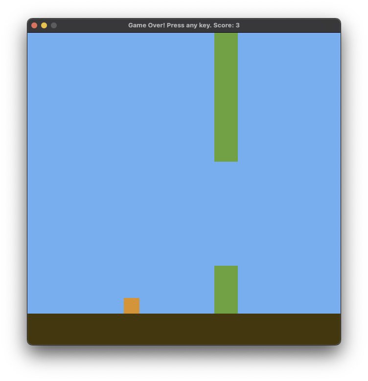

## Flappy Bird

My very rudimentary ("minimalist") implementation of flappy bird using SDL.

To build this, you need SDL2 installed. You can clone this repo, then:

```
make       # build
./bin/app  # play
```

You probably wouldn't want to, though, since this is what it looks like:


